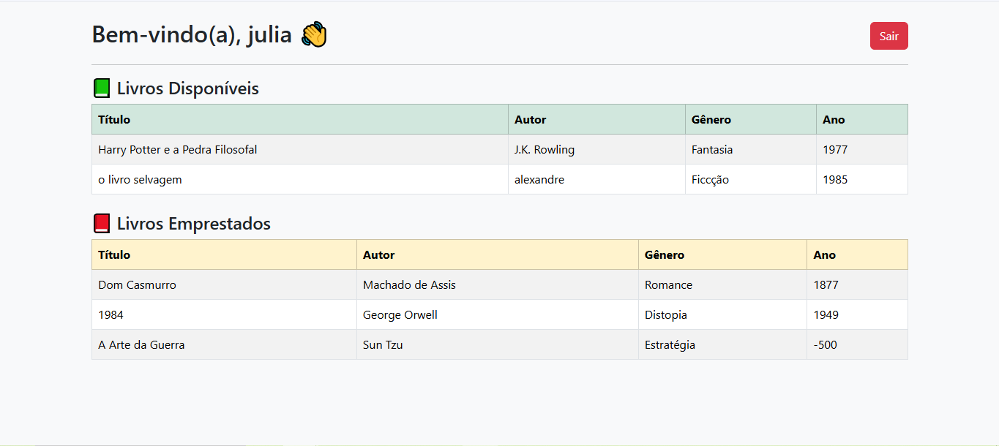

# 📚 Sistema de Gerenciamento de Livros

Este projeto foi desenvolvido com o intuito de treinar operações **CRUD** utilizando as tecnologias:
- **PHP**
- **MySQL**
- **HTML**
- **CSS**
- **JavaScript**

---

## 🚀 Objetivo do Projeto
O sistema tem como propósito simular um pequeno gerenciamento de biblioteca, onde existem **Leitores** e **Funcionários**.  
Os funcionários possuem acesso especial para cadastrar e gerenciar os livros, enquanto os leitores podem visualizar os livros disponíveis e emprestados.

---

## 🗄️ Estrutura do Banco de Dados
O banco de dados se chama **`livro`** e possui as seguintes tabelas:

- **livro** → informações sobre cada livro (título, autor, gênero, ano etc.)  
- **leitor** → informações simples de cadastro dos leitores  
- **funcionário** → inclui uma senha especial chamada **SEPF (Senha Especial para Funcionário)**, de 5 dígitos, que dá acesso exclusivo à área administrativa.

---

## 🔑 Funcionalidades

👤 **Área do Leitor**
- Login simples
- Visualização de livros disponíveis
- Visualização de livros emprestados

👨‍💼 **Área do Funcionário**
- Login com **SEPF** (senha especial para funcionario) tem 5 digitos
- Cadastro de funcionários
- Cadastro de livros
- Listagem de livros cadastrados
- Funções **Editar** e **Excluir**

---

## 🖼️ Demonstração

### 🔹 Tela de Login

### 🔹 Dashboard do Leitor

---

## 🎯 Motivação
O projeto foi desenvolvido como um **exercício prático** para:
- Refrescar a memória
- Colocar em prática os conhecimentos adquiridos na **faculdade** e no **ensino técnico de informática**

---

